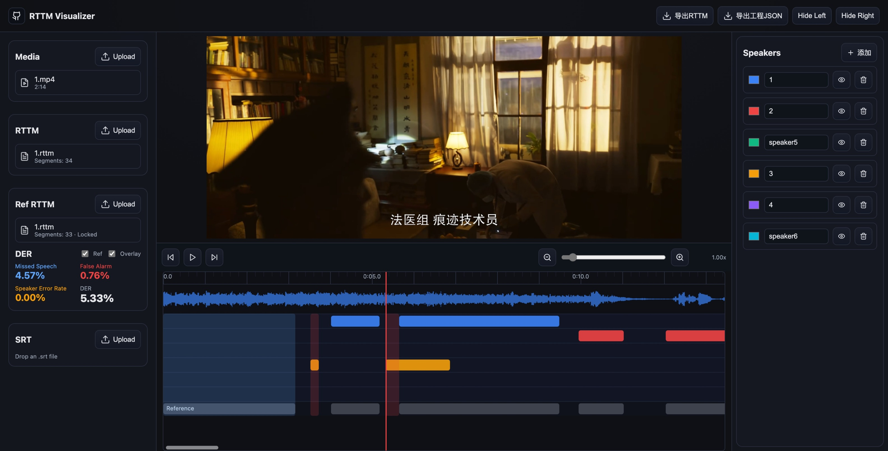

# RTTM Visualizer

[English](README_EN.md) | [中文](README.md)

> If you find this project useful, please star the repo. Questions and ideas are welcome in Issues. ⭐

A lightweight, browser-based speaker diarization visualizer and **editor**. Load media and RTTM to quickly inspect and edit who speaks when.



## Features
- Visualize and align media with `RTTM` on a unified timeline; optional `.srt` subtitle preview and lookup; color-coded speaker tracks; 0.25–10× zoom and drag
- DER diagnostics: side-by-side reference vs system with overlay for Missed Speech (blue), False Alarm (red), and Speaker Error (orange); on-the-fly `MS/FA/SER/DER`; greedy 1:1 mapping by overlap
- Interactive editing: click to create, drag edges to adjust, right-click to delete; prevent same-speaker overlaps with min duration; speaker legend supports rename, recolor, toggle, and delete; lock reference track to avoid mistakes
- I/O and reproducibility: one-click export of system `RTTM` and full project `JSON`; drag-and-drop loading, or auto-load the first media from `exp/raw/` and the first RTTM from `exp/rttm/`

## Run
```bash
npm install
npm run dev
```

## RTTM format
[RTTM (Rich Transcription Time Marked)](https://stackoverflow.com/a/74358577) is a time-stamped annotation format widely used in speaker diarization. Example line (file id, start time, duration, speaker id):
```
SPEAKER file 1 12.340 3.210 <NA> <NA> spk1 <NA>
```

## Built w/ AI

This repo was partly built with AI tools, including [21st.dev](https://21st.dev/), [GPT-5](https://chat.openai.com/chat), and [Cursor](https://cursor.com/en/home). In the “code is cheap” era, I also share my AI-assisted development workflow on my Bilibili channel (CN): [安如衫](https://www.bilibili.com/video/BV1BXbPzeEoL/).

Additionally, I will include some of thought-provoking conversations (at least to me) with AI in the `./docs/llm` directory, which may provide insights or inspiration for you.

## Related

Here are some awesome speaker diarization repos to explore.

- [modelscope/3D-Speaker](https://github.com/modelscope/3D-Speaker) — a state-of-the-art, comprehensive toolkit for speaker verification, recognition, and diarization. 